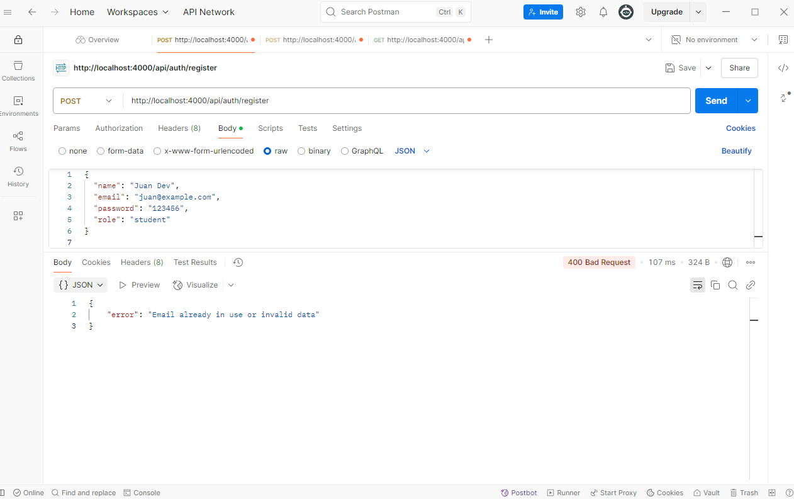
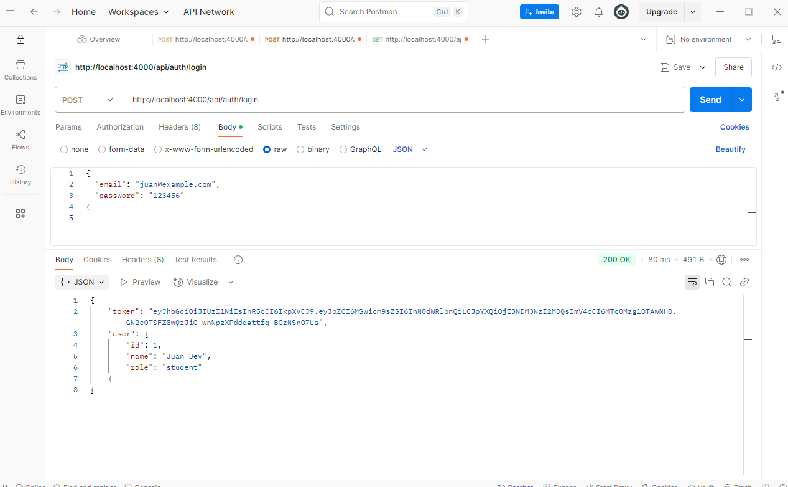
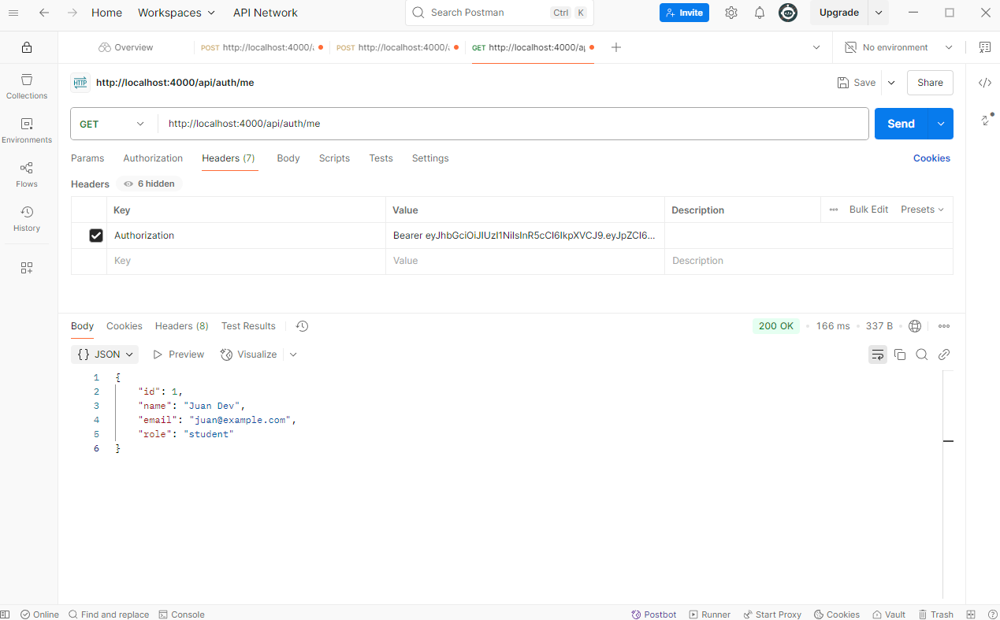

# GradLink 💼🎓


> .[!IMPORTANT]. 
> IMPORTANTE CHAVALES!!!
> Teneis que hacer esto como setup:

1. Instalar PostgreSQL en su PC
2. Crear la base de datos con:
   ```sql
   CREATE DATABASE gradlink;
   ```
3. Crear un archivo `.env` en la carpeta del backend con esto (poned vuestra contra real):

   ```env
   PORT=4000
   DB_HOST=localhost
   DB_PORT=5432
   DB_USERNAME=postgres
   DB_PASSWORD=tu contra
   DB_DATABASE=gradlink
   JWT_SECRET=lo que sea pero largo
   ```

---

##  Lo que hay de backemd

### API:

- Registro de usuarios (`/api/auth/register`)
- Login con JWT (`/api/auth/login`)
- Ruta devuelve el usuario para verificar jwt (`/api/auth/me`)

### Para que veais y entendais mejor, ñas pruebas que he heco con Postman:

#### Registro (`POST /api/auth/register`)


---

#### Login (`POST /api/auth/login`)


---

#### Me (`GET /api/auth/me` con token)
> Tienes que poner el token en el header como `Authorization: Bearer <token>`


---

> .[!IMPORTANT]. 
> ANTES DE TOCAR CODIGO PROBAR EXACTAMENTE LO MISMO, HASTA QUE NO OS FUNCIONE PERF NO METAIS CODIGO QUE SINO LIADA
