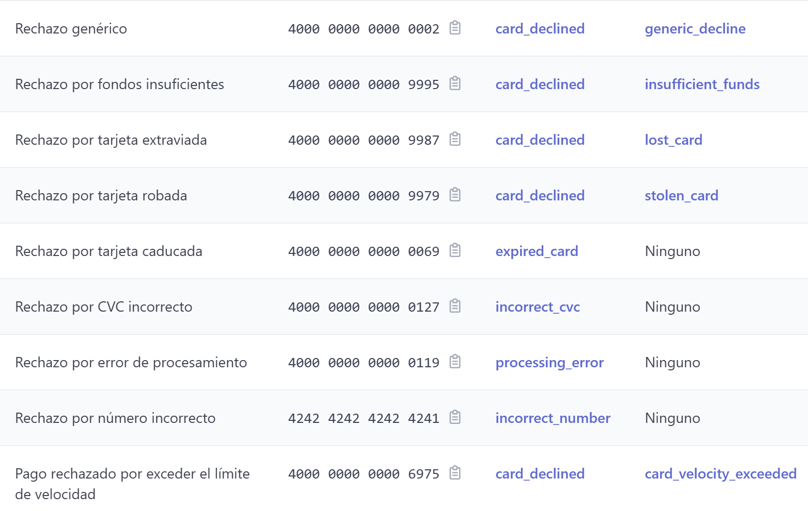

# GradLink

Tarjeta de prueba funcionamiento correcto española(los demas datos que sean validos pero inventados):
  4000 0072 4000 0007

Paleta de colores:

--color-1: #11284b; // navbar y textos fuertes
--color-2: #2b4e6e; // iconos o etiquetas destacadas
--color-3: #4c7f8a; // acentos o estados
--color-4: #f0c0a3; // detalles visuales suaves
--color-5: #fdf5e7; // fondo base

Migration commands:
 npx typeorm migration:generate src/migrations/AddedStudentVerification --dataSource src/data-source.js --o

 npx typeorm migration:run --dataSource src/data-source.js