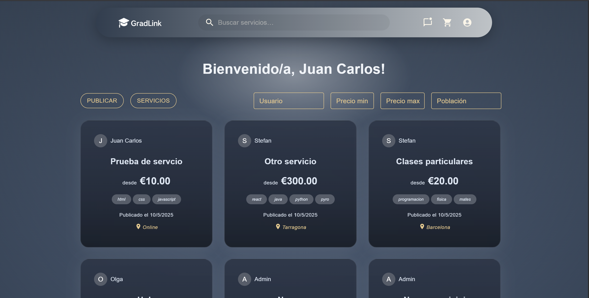

# GradLink Practice Setup & Execution

Este repositorio contiene dos partes: el **backend** (API REST con TypeORM y Stripe) y el **frontend** (React), cuyo punto de entrada es la sigueinte captura que muestra la pantalla de inicio (*Home*).



## Requisitos previos

* Tener PostgreSQL instalado y ejecutándose.
* Crear la base de datos `gradlink` en PostgreSQL.
* Node.js v16+ y npm.

## Variables de entorno

Crea un fichero `.env` en la raíz del backend con el siguiente contenido:

```dotenv
PORT=4000
DB_HOST=localhost
DB_PORT=5432
DB_USERNAME=postgres
DB_PASSWORD=postgres
DB_DATABASE=gradlink
JWT_SECRET=blabla
JWT_VERIF_SECRET=blabla
STRIPE_SECRET_KEY=sk_test_blabla
FRONTEND_URL=http://localhost:3000
BACKEND_URL=http://localhost:4000
ALLOWED_INSTITUTIONAL_DOMAINS=bla,bla,bla,bla
```

## Pasos de instalación

0. **Descargar Postgres**

   * `https://www.postgresql.org/download/`


   ```bash
   CREATE DATABASE gradlink;
   ```

1. **Clonar el repositorio**

   ```bash
   https://github.com/juancaa03/GradLink.git
   cd GradLink
   ```

2. **Instalar dependencias en backend**

   ```bash
   cd backend
   npm install
   ```

3. **Ejecutar migraciones**

   ```bash
   npx typeorm migration:run --dataSource src/data-source.js
   ```

4. **Iniciar backend**

   En una terminal:
   ```bash
   npm run dev
   ```

5. **Instalar dependencias en frontend**
   En otra terminal:

   ```bash
   cd frontend
   npm install
   ```

6. **Iniciar frontend**
   ```bash
   npm run dev
   ```

## Pruébalo

* Abre el navegador en `http://localhost:3000` para ver la capa *Home*.
* Regístrate y crea pedidos.
* Para probar pagos con Stripe, utiliza la tarjeta de prueba:
  ```text
  4000 0072 4000 0007
  ```

¡A jugar! 🎉